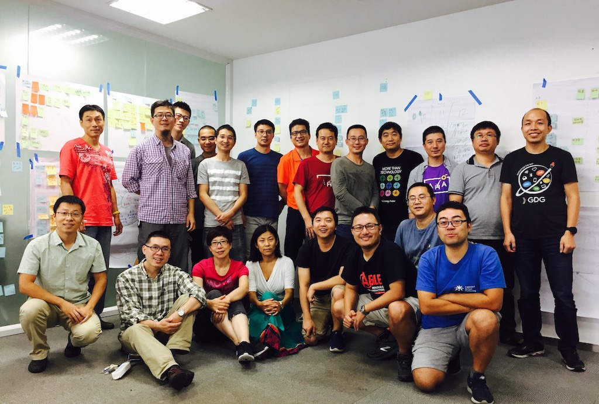

# 共创初始版本

[吕毅](https://github.com/yilv "Lv Yi")在2017年7月14日的一篇朋友圈分享里说到：

> “李志的334计划是用12年的时间在全国334个城市开演唱会来把现场音乐带给更多人，很欣赏这份热情和行动！我一直想把过去些年积累的系统思考在产品开发组织的应用能介绍给更多人，也是时候该行动了 :)。”

未曾预料到的是，这样的一份陈述引起了社区里诸多朋友的共鸣。接下来发生的事情就变得非常自然，越来越多的响应，越来越大的热情，于是，九月相聚杭州，共创工作坊计划便就在那些天确定下来。从预想的六七位好友的相聚，迅速扩大成了近五十位共创者的群，大家花了近一个多月线上的讨论，各自线下准备，再讨论。最终，有二十一位来自全国各地的朋友在9月21日和22日两天相聚在了一起，地点也由原来计划的西湖边，改到了钱塘江边。

在分组激烈的讨论和思维碰撞中，不断地迭代梳理和优化工作坊引导手册内容，本手册就是来自这些朋友们，感谢他们的积极参与和无私分享。

感谢！

* [写在前面](./README.md)
* [第一部分](./part1/README.md)
    * [1. 系统思考概述](./part1/brief_introduction.md)
    * [2. 初识CLD](./part1/cld_reading.md)
* [第二部分](./part2/README.md)
    * [3. 变量和链路](./part2/cld_elements.md)
    * [4. 发现回路(R/B)](./part2/loop.md)
    * [5. 复杂回路及系统基模](./part2/more_loop_systems_archetypes.md)
* [第三部分](./part3/README.md)
    * [6. 实际问题分析](./part3/study_of_actual_problems.md)
* [参考练习](./exercises/README.md)
    * [城市人口问题](./exercises/loops_city_population.md)
    * [女王的选择](./exercises/the_queue_s_choice.md)
* [参考案例](./cases/README.md)
    * [神奇公司](./cases/wonder_company.md)
    * [《狼图腾》节选](./cases/wolf_totem.md)
* [参考文献](./reference.md)
